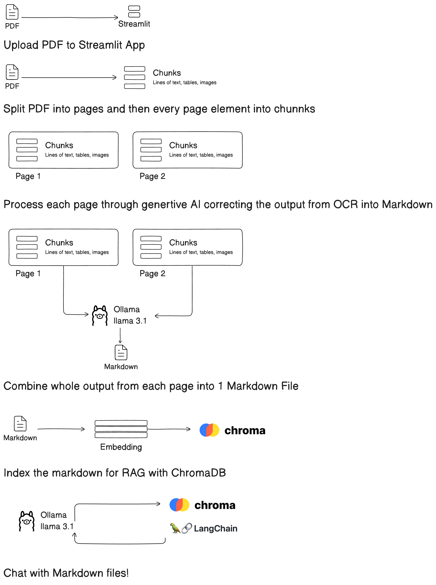

# Local PDF to Markdown with AI Solution

This Streamlit application converts PDF documents into Markdown format using AI-powered analysis. It processes each page, extracts text, identifies document elements, and formats the content for indexing.

This project was created to address the challenges of preparing PDF data for indexing, which can be a time-consuming and complex process.


## Features

- **PDF Upload:** Allows users to upload PDF documents.
- **AI-Powered Analysis:** Utilizes AI to analyze each page of the PDF, identifying paragraphs, tables, images, and headings. It also uses AI to fill in any gaps or fix formatting issues that may occur during extraction.
- **Data Extraction:** Extracts relevant data from the analyzed pages.
- **Markdown Output:** Formats the extracted data into Markdown for easy indexing and readability.


| Diagram                  | Challenges     |
|--------------------------|----------------|
|   | <ul><li>This project aims to address the following challenges:</li><li>PDFs are not always well formatted for indexing.</li><li>Paragraphs are sometimes separated by a line break, which is not recognized as a new paragraph.</li><li>Sometimes content overflows one page to another.</li><li>Tables are sometimes formatted differently in one document compared to another.</li><li>Images are sometimes created with word art shapes, which are difficult to extract using Python.</li><li>Data in one PDF can be repeated in another PDF with slight differences, which can poison the results.</li><li>Relying on a script to index one PDF according to rulesets works fine, but indexing many PDFs with different formats presents problems of consistency.</li></ul> |

## How to Use

1.  Upload a PDF file using the file uploader.
2.  The application will process the PDF, analyze each page, and extract the data.
3.  The extracted data will be formatted into Markdown and displayed.

## Status

### Working Features
- [x] PDF Upload
- [x] Ollama Support
- [x] Output to Markdown
- [x] Basic OCR of test
- [x] Basic OCR of Tables

### Not Working Features
- [ ] Image Extraction
- [ ] Image OCR
- [ ] Bullet and Numbered Lists
- [ ] Paragraph Indentation
- [ ] Page Overflow of Content
_ [ ] Advanced Tables

## How the Python App Works

The `app.py` file is a Streamlit application that processes PDF documents. It uses the PyMuPDF library to extract text and images from the PDF. It then uses the Ollama library to format the extracted text into Markdown. The app displays the PDF and the extracted text side-by-side, and allows the user to download the modified PDF and the formatted markdown.

## Project Structure

The project is structured as follows:

-   `app.py`: The main Streamlit application file.
-   `utils.py`: Contains utility functions for PDF processing and AI analysis.
-   `requirements.txt`: Lists the project dependencies.

## Dependencies

-   streamlit
-   PyPDF2
-   (Other AI/ML libraries used for analysis)

## Installation

1.  Clone the repository:

    ```bash
    git clone <repository_url>
    ```
2.  Navigate to the project directory:

    ```bash
    cd <project_directory>
    ```
3.  Install the required dependencies:

    ```bash
    pip install -r requirements.txt
    ```

## Running the Application

To run the Streamlit application:

```bash
streamlit run app.py
```

## Contributing

Contributions are welcome! Please feel free to submit pull requests.

## Docker Compose

To run the application using Docker Compose:

1.  Ensure you have Docker and Docker Compose installed.
2.  Navigate to the project directory:

    ```bash
    cd <project_directory>
    ```
3.  Run the following command:

    ```bash
    docker-compose up --build
    ```

## License

This project is licensed under the MIT License.
